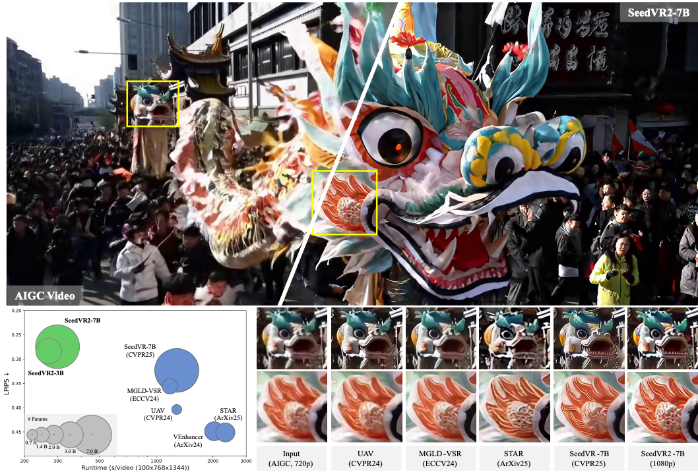

<div align="center">
  
</div>

<div align="center">

<h1>
    SeedVR2:<br> 
    One-Step Video Restoration via Diffusion Adversarial Post-Training
</h1>

<div>
    <a href='https://iceclear.github.io' target='_blank'>Jianyi Wang<sup>1,2</sup></a>&emsp;
    <a href='https://scholar.google.com/citations?user=EDWUw7gAAAAJ&hl=en' target='_blank'>Shanchuan Lin<sup>2</sup></a>&emsp;
    <a href='https://scholar.google.com/citations?user=xXMj6_EAAAAJ&hl=en' target='_blank'>Zhijie Lin<sup>2</sup></a>&emsp;
    <a href='https://scholar.google.com.hk/citations?user=C_6JH-IAAAAJ&hl=en' target='_blank'>Yuxi Ren<sup>2</sup></a>&emsp;
    <a href='https://openreview.net/profile?id=~Meng_Wei11' target='_blank'>Meng Wei<sup>2</sup></a>&emsp;
    <a href='https://zsyoaoa.github.io/' target='_blank'>Zongsheng Yue<sup>1</sup></a>&emsp;
    <a href='https://shangchenzhou.com/' target='_blank'>Shangchen Zhou<sup>1</sup></a>&emsp;
    <a href='https://haochen-rye.github.io/' target='_blank'>Hao Chen<sup>2</sup></a>&emsp;
    <a href='https://scholar.google.com/citations?user=uPmTOHAAAAAJ&hl=zh-CN' target='_blank'>Yang Zhao<sup>2</sup></a>&emsp;
    <a href='https://ceyuan.me/' target='_blank'>Ceyuan Yang<sup>2</sup></a>&emsp;
    <a href='https://scholar.google.com/citations?user=CVkM9TQAAAAJ&hl=en' target='_blank'>Xuefeng Xiao<sup>2</sup></a>&emsp;
    <a href='https://www.mmlab-ntu.com/person/ccloy/' target='_blank'>Chen Change Loy<sup>1</sup></a>&emsp;
    <a href='http://www.lujiang.info/' target='_blank'>Lu Jiang<sup>2</sup></a>
</div>
<div>
    <sup>1</sup>S-Lab, Nanyang Technological University&emsp;
    <sup>2</sup>ByteDance Seed
</div>

<div>
    <h4 align="center">
        <a href="https://iceclear.github.io/projects/seedvr2/" target='_blank'>
        
        </a>
        <a href="http://arxiv.org/abs/2506.05301" target='_blank'>
        
        </a>
        <a href="https://github.com/ByteDance-Seed/SeedVR">
            
        </a>
        <a href="https://huggingface.co/ByteDance-Seed/SeedVR-Models">
          
        </a>
        <a href="https://www.youtube.com/watch?v=tM8J-WhuAH0" target='_blank'>
        
        </a>
        
    </h4>
</div>

<strong>SeedVR2 is a one-step large diffusion-transformer model that is capable of restoring videos with any resolution in a single step, w/o relying on any additional diffusion prior.</strong>

<div style="width: 100%; text-align: center; margin:auto;">
    
</div>

---
</div>

## 🔥 Update
- [2025.06] 🔥🔥🔥 [Inference code](https://github.com/ByteDance-Seed/SeedVR/tree/main) and [model weights](https://huggingface.co/ByteDance-Seed/SeedVR-Models) released!
- [2025.06] Repo created. The open-source process is under review and we will keep updating the news in this page.

---

> **SeedVR2:** *Recent advances in diffusion-based video restoration (VR) demonstrate significant improvement in visual quality, yet yield a prohibitive computational cost during inference. While several distillation-based approaches have exhibited the potential of one-step image restoration, extending existing approaches to VR remains challenging and underexplored, particularly when dealing with high-resolution video in real-world settings. In this work, we propose a one-step diffusion-based VR model, termed as SeedVR2, which performs adversarial VR training against real data. To handle the challenging high-resolution VR within a single step, we introduce several enhancements to both model architecture and training procedures. Specifically, an adaptive window attention mechanism is proposed, where the window size is dynamically adjusted to fit the output resolutions, avoiding window inconsistency observed under high-resolution VR using window attention with a predefined window size. To stabilize and improve the adversarial post-training towards VR, we further verify the effectiveness of a series of losses, including a proposed feature matching loss without significantly sacrificing training efficiency. Extensive experiments show that SeedVR2 can achieve comparable or even better performance compared with existing VR approaches in a single step.* 

## 📑 Citation

   If you find our repo useful for your research, please consider citing our paper:

   ```bibtex
   @article{wang2025seedvr2,
      title={SeedVR2: One-Step Video Restoration via Diffusion Adversarial Post-Training},
      author={Wang, Jianyi and Lin, Shanchuan and Lin, Zhijie and Ren, Yuxi and Wei, Meng and Yue, Zongsheng and Zhou, Shangchen and Chen, Hao and Zhao, Yang and Yang, Ceyuan and Xiao, Xuefeng and Loy, Chen Change and Jiang, Lu},
      booktitle={arXiv preprint arXiv:2506.05301},
      year={2025}
   }

   @inproceedings{wang2025seedvr,
      title={SeedVR: Seeding Infinity in Diffusion Transformer Towards Generic Video Restoration},
      author={Wang, Jianyi and Lin, Zhijie and Wei, Meng and Zhao, Yang and Yang, Ceyuan and Loy, Chen Change and Jiang, Lu},
      booktitle={CVPR},
      year={2025}
   }
   ```


## 📝 License

This project is under the copyright of [ByteDance Pte Ltd](https://www.bytedance.com/en/). Redistribution and use should get the permission from [ByteDance Pte Ltd](https://www.bytedance.com/en/).


## 📧 Contact
If you have any questions, please feel free to reach us at `iceclearwjy@gmail.com`.
